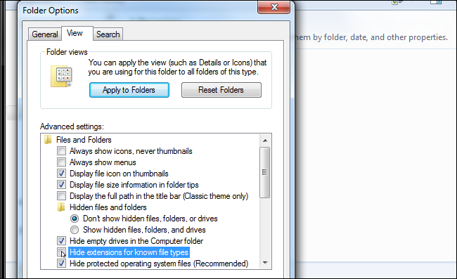
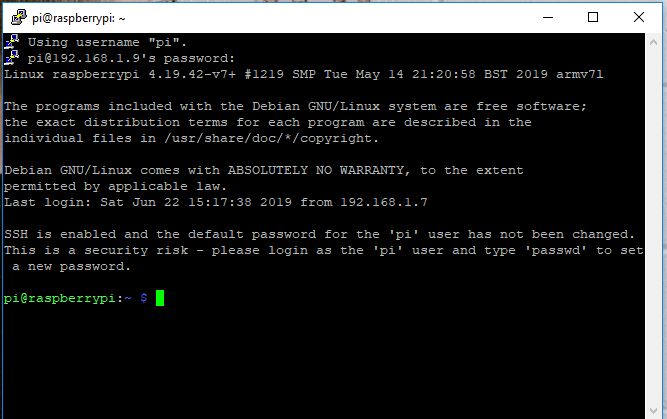

# Installing  Raspbian on Raspberry Pi ZERO W, for Windows user.


---
This guide will show you step by step, how to install a Raspbian OS  on
**Raspberry Pi Zero W**, enable **ssh** service and configure **WiFi** connection
without using a keyboard, screen and mouse .

For this installation we need some equipment and software.
  - MicroSD card.
  - MicroSD card reader , if your computer don’t have a MicroSD card slot.
  - Power supply with micro USB cable.

Software:
  - Rasbpian image .
  - Etcher Software .

  The process is very simple, download a Raspbian image and Etcher software,
  use Etcher to write the Raspbian image into the MicroSD card , configure WiFi connection
  enable SSH service and boot.


## 1. Downloading Raspbian.
 - Download the Rasbpian image, you can find the latest version here  [Raspbian image](https://www.raspberrypi.org/downloads/raspbian/).

 

## 2. Copy Raspbian to the MicroSD card
 The simplest and easiest way to copy the Raspbian OS to your MicroSD card is, Etcher software.It's work well on Windows.

 - Download a Windows version of  Etcher software, from  [Etcher](https://etcher.io/)

 

 - Unzip it.
 - Install Etcher on your Windows system.

 

 - Insert the MicroSD card into the card reader.

 

  - Execute Etcher.
  - Once Etcher open, browse and select the Raspbian image.

  

  - Select the MicroSD card that you which to install Raspbian on.
  - Click on the flash button.

  


## 3. Configure Wifi

To prevent futur probleme we'll activate file extension display on windows by following 
this instructions:

### On windows 8 and 10
- After opening a file browser click the “View” tab on the ribbon. 
- Activate the “File name extensions” box in the Show/hide section to toggle file extensions on or off. 

File Explorer will remember this setting until you disable it in the future.


### For windows 7

- After opening a file browser Click the “Organize” button on Windows Explorer’s toolbar and select “Folder and search options” to open it.
- Click the “View” tab at the top of the Folder Options window. Disable the “Hide extensions for known file types” checkbox under Advanced settings.
- Click “OK” to change your settings.





  To configure WiFi connection on Rapsberry Pi Zero W do

  - Remove the MicroSD card from the SD card reader.
  - Reinsert the Micro SD card into computer SD card reader.
  - Observe that a *boot* partition will mount automatically.

  

  - open **notepad** and copy/paste the following lines

```bash
	country=AU
	ctrl_interface=DIR=/var/run/wpa_supplicant GROUP=netdev
	update_config=1
        network={
	        ssid="SSID"
	        psk="PASSWORD"
	        key_mgmt=WPA-PSK
        }
```

 - Replace **SSID** with your Wifi ID and **PASSWORD** with your Wifi password.
 - Save the file as **wpa_supplicant.conf** under **boot** partition.


### On linux

By putting the MicroSD Card on Linux, you will have the
**rootfs** partition then save it as **wpa_supplicant.conf** under **rootfs** partition under **/etc/wpa_supplicant/**


 <!--  -->


## 4. Enable ssh

 - Launch Notepad
 - Click on **File** and then **Save As..**, a dialog box is displayed.
 - Type an opening quotation mark, ssh and then closing quotation mark. That way **"ssh"**.    


 - Click on the SD card **boot** partition to save file on it.
 - Click the **Save** button.


## 5. First boot

- Insert the Micro SD into Raspberry Pi Zero,
- Power with Micro USB cable (at least 2.5 A).


- To access to your Raspberry Pi , via your Windows computer you need a ssh client
  like putty [putty](https://www.chiark.greenend.org.uk/~sgtatham/putty/latest.html)


To connect to your device you must first get device ip, there are more than onw way to do it, the easiest
one is to install mobile app **Fing**, The Fing app is a free network scanner for smartphones.


Your phone and your Raspberry Pi have to be on the same network.

So connect your phone to the correct wireless network (same ssid you used in wpa_supplicant)
- Start the app on your phone
- click on refresh button
- all connected ip will be displayed
- search for the one with raspberry pi icon

Congratulation you have your ip

To explore more way please visit [get ip address of raspberry pi](https://www.raspberrypi.org/documentation/remote-access/ip-address.md)

### Using putty

Suppose your raspberry pi ip is **192.168.1.9** the result on putty will be as following

**pi** are the default user for rasbian 


After clicking on **Open** and you'll see a new windows asking you to trust the host you're going to connect to

Just click yes (we trust our Raspberry pi)


a new terminal window will open ask you the password which is **raspberry**

Dont worry if you dont see it when you type it, just type it and click Enter on your keyboard


Congratulation if you see the next terminal window, you're connected to your device




- Complete ssh command to connect in linux based os:

```bash
$ ssh pi@192.168.1.9
```

